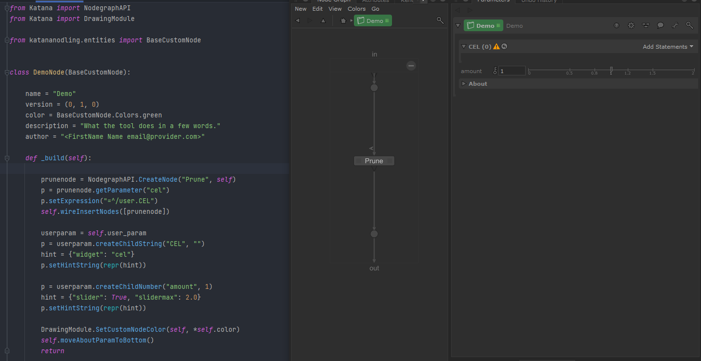

# katananodling

Package for Foundry Katana software.

A simple API to create and register a custom type of node called "CustomNode"
, the mix between a macro and a SuperTool.

Have a look at [./demolibrary/demo](./demolibrary/demo.py) to see how a new type
of node can simply be created.

> **Note** 
> This repo has been extracted from [opscripting](https://github.com/MrLixm/opscripting).
> To get all the commit history looks for commit on the previously named
> `customtooling` directory there.

# Documentation

> 
> Or see the [./doc directory](doc).
